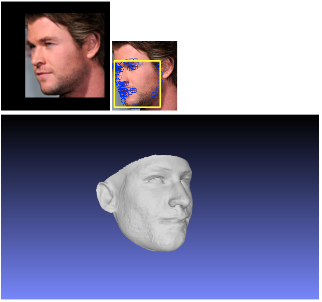

# Face-Vision-3D_Models

### Dependencies

Before compiling the code, please, make sure to have all the required data in the following specific folder:
- **[Download Bump-CNN](https://docs.google.com/forms/d/11zprdPz9DaBiOJakMixis1vylHps7yn8XcSw72fecGo)** and move the CNN model (1 file: `ckpt_109_grad.pth.tar`) into the `CNN` folder
- **[Download PyTorch CNN model](https://docs.google.com/forms/d/e/1FAIpQLSd6cwKh-CO_8Yr-VeDi27GPswyqI9Lvub6S2UYBRsLooCq9Vw/viewform)** and move the CNN model (3 files: `shape_model.pth`, `shape_model.py`, `shape_mean.npz`) into the `CNN` folder
- **[Download the Basel Face Model](http://faces.cs.unibas.ch/bfm/main.php?nav=1-2&id=downloads)** and move `01_MorphableModel.mat` into the `3DMM_model` folder
- **[Acquire 3DDFA Expression Model](http://www.cbsr.ia.ac.cn/users/xiangyuzhu/projects/3DDFA/Code/3DDFA.zip)**, run its code to generate `Model_Expression.mat` and move this file the `3DMM_model` folder
- Go into `3DMM_model` folder. Run the script `python trimBaselFace.py`. This should output 2 files `BaselFaceModel_mod.mat` and `BaselFaceModel_mod.h5`.
- **[Download dlib face prediction model](http://dlib.net/files/shape_predictor_68_face_landmarks.dat.bz2)** and move the `.dat` file into the `dlib_model` folder.

Note that we modified the model files from the 3DMM-CNN paper. Therefore, if you generated these files before, you need to re-create them for this code.

## Installation

- Install [Docker CE](https://docs.docker.com/install/)
- With Linux, [manage Docker as non-root user](https://docs.docker.com/install/linux/linux-postinstall/)
- Install [nvidia-docker](https://github.com/NVIDIA/nvidia-docker)
- Build docker image:
```
	docker build -t extreme-3dmm-docker .
```

## Usage

### Start docker container
If you compile the code with Docker, you need to start a Docker container to run the code. You also need to set up a shared folder to transfer input/output data between the host computer and the container.
- Prepare the shared folder on the host computer. For example, `/home/ubuntu/shared`
- Copy input data (if needed) to the shared folder
- Start container:
```
	nvidia-docker run --rm -ti --ipc=host --privileged -v /home/ubuntu/shared:/shared extreme-3dmm-docker bash
```
Now folder `/home/ubuntu/shared` on your host computer will be mounted to folder `/shared` inside the container

### 3D face modeling with realistic details from a set of input images
* Go into `demoCode` folder. The demo script can be used from the command line with the following syntax:

```bash
$ Usage: python testBatchModel.py <inputList> <outputDir>
```

where the parameters are the following:
- `<inputList>` is a text file containing the paths to each of the input images, one in each line.
- `<outputDir>` is the path to the output directory, where ply files are stored.

The output 3D models will be `<outputDir>/<imageName>_<postfix>.ply` with `<postfix>` = `<modelType>_<poseType>`. `<modelType>` can be `"foundation"`, `"withBump"` (before soft-symmetry),`"sparseFull"` (soft-symmetry on the sparse mesh), and `"final"`. `<poseType>` can be `"frontal"` or `"aligned"` (based on the estimated pose).
The final 3D shape has `<postfix>` as `"final_frontal"`.

The PLY files can be displayed using standard off-the-shelf 3D (ply file) visualization software such as [MeshLab](http://meshlab.sourceforge.net).


### Sample Outputs


