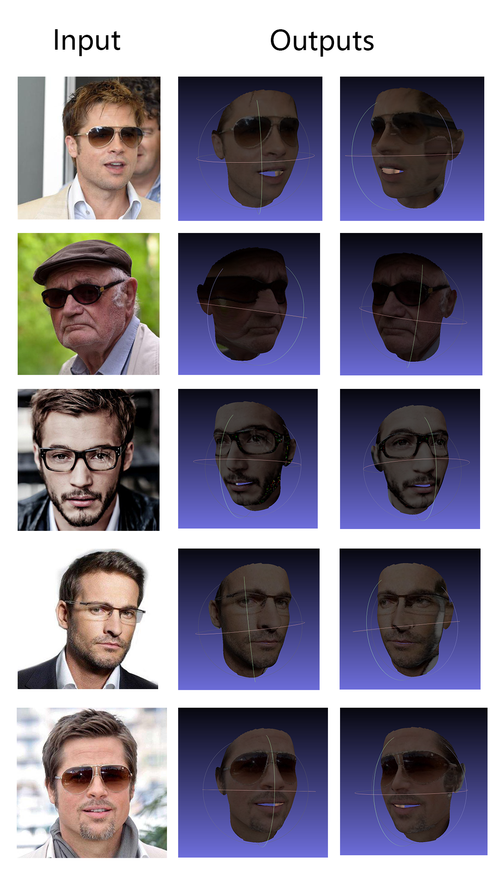

# Face-Vision-3D_Pose


### Dependencies

required packages: 

 - Python 3.6
 - PyTorch >= 0.4.1
 - Numpy
 - Scipy
 - matplotlib
 - Dlib 
 - OpenCV 
 - Cython 

run `pip install -r requirements.txt` to install the required dependencies.


### Inference

1. Build cython module (just one line for building)
   ```
   cd utils/cython
   python3 setup.py build_ext -i
   ```
2.  Run `python3 main.py -f samples/test1.jpg`. The results will saved in `samples/` directory.


### Pretrained Model
- Please download models from [here](https://drive.google.com/open?id=1kxgOZSds1HuUIlvo5sRH3PJv377qZAkE) and put it under "models/".

### Sample Outputs

