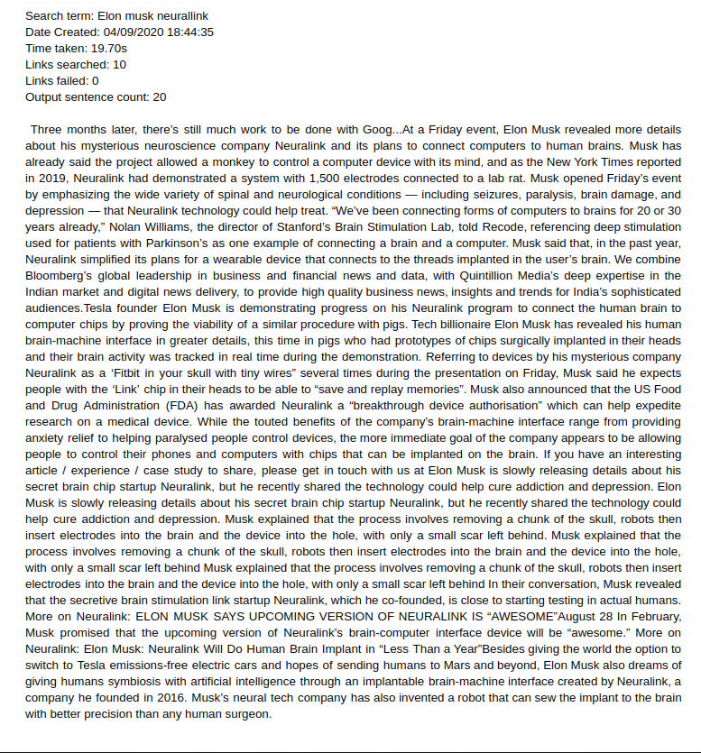
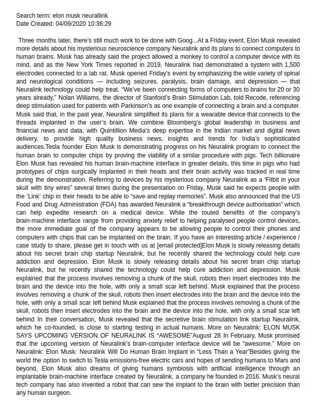

# GoogleNews_ScrapeSummarize

Generates a summary of the news from the topic given.

### Dependencies

required packages: 
```
- Python 3.6
- requests==2.24
- requests-file==1.5.1
- idna==2.10
- selenium==3.141.0
- regex==2020.7.14
- sumy==0.8.1
- numpy==1.19.1
- newspaper3k==0.2.8
- Flask
```


run `pip install -r requirements.txt` to install the required dependencies.

### Generating the summary

- Run the command `python scrape_summarize.py --search 'SEARCH_TERM'` directory to generate the summary. The results saved in the `outputs` directory.
- Two other paramets are:
- * `--num_links` to select the number of links to srape from. The default value is set to `10`.
- * `--sent_count` to limit the output sentence count. The default value is set to `20`.

### Additional Information

- A flask api is created and it can be run with the command `python scrapper_api.py`.
- The api accepts a json file of the format given below and returns the summary.
```
{
    "search_term" : "SEARCH_TERM",
    "num_links" : 10    ,
    "sent_count" : 20
}
```

### Sample Outputs

- Output 1


- Output 2
