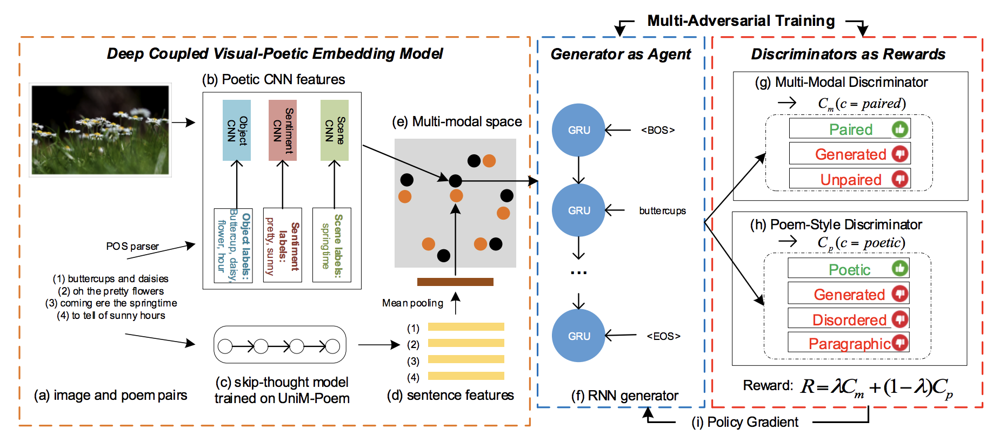

# Poem-generation

### Dependencies

required packages: 

- `python2.7`
- `tensorflow 1.6`
- `mxnet`
- `opencv`
- `tqdm`
- `colorama`
- `flask`

run `pip2 install -r requirements.txt` to install the required dependencies.

### Inference
- Run `python2 test.py` in `src/` to generate examples caption. The results will be opened in a window.

### Pretrained Model
- Please download models from [here](https://1drv.ms/u/s!AkLgJBAHL_VFgSyyfpeGyGFZux56) and put it under "model/".

### Additional Information

- A flask api is created and it can be run with the command `python poemGenerationAPI.py`.

### Sample Outputs

