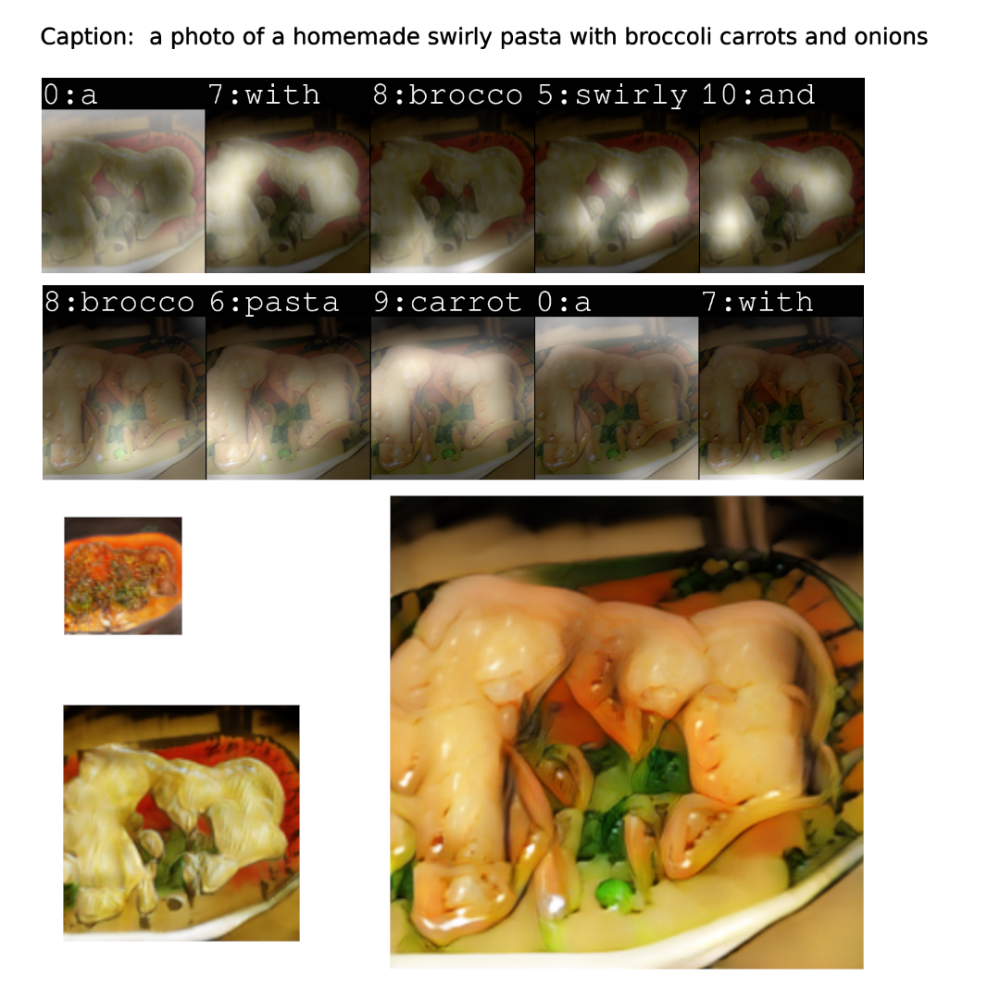

# Words-Vision-AttnGAN

### Dependencies

required packages: 

- `python 3.6`
- `Pytorch 1.0+`
- `python-dateutil`
- `easydict`
- `pandas`
- `torchfile`
- `nltk`
- `scikit-image`

run `pip install -r requirements.txt` to install the required dependencies.

### Sampling
- Run `python3 main.py --cfg cfg/eval_coco.yml --gpu 0` to generate examples from captions in files listed in "./data/birds/example_filenames.txt". Results are saved to `models/`. 
- Change the `eval_*.yml` files to generate images from other pre-trained models. 
- Input your own sentence in "./data/birds/example_captions.txt" if you wannt to generate images from customized sentences. 

### Training

- Pre-train DAMSM models:
  - For bird dataset: `python pretrain_DAMSM.py --cfg cfg/DAMSM/bird.yml --gpu 0`
  - For coco dataset: `python pretrain_DAMSM.py --cfg cfg/DAMSM/coco.yml --gpu 0`
 
- Train AttnGAN models:
  - For bird dataset: `python main.py --cfg cfg/bird_attn2.yml --gpu 0`
  - For coco dataset: `python main.py --cfg cfg/coco_attn2.yml --gpu 0`

- `*.yml` files are example configuration files for training/evaluation our models.

### Pretrained Model
- [DAMSM for bird](https://drive.google.com/open?id=1GNUKjVeyWYBJ8hEU-yrfYQpDOkxEyP3V). Download and save it to `DAMSMencoders/`
- [DAMSM for coco](https://drive.google.com/open?id=1zIrXCE9F6yfbEJIbNP5-YrEe2pZcPSGJ). Download and save it to `DAMSMencoders/`
- [AttnGAN for bird](https://drive.google.com/open?id=1lqNG75suOuR_8gjoEPYNp8VyT_ufPPig). Download and save it to `models/`
- [AttnGAN for coco](https://drive.google.com/open?id=1i9Xkg9nU74RAvkcqKE-rJYhjvzKAMnCi). Download and save it to `models/`

- [AttnDCGAN for bird](https://drive.google.com/open?id=19TG0JUoXurxsmZLaJ82Yo6O0UJ6aDBpg). Download and save it to `models/` 

### Sample Outputs

